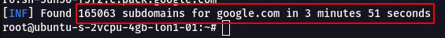
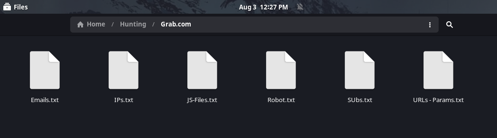

# 😀 Reconnaissance

## "Hackers make the mistake of paying attention to the exploitation process, and neglecting the information gathering stage “

> **So i will talk about Reconnaissance ..**

## 💭 Whoami :

> **I'm\[ Abdelrahman Ali H3ckt00r] ,** Jr. Penetration Tester&#x20;

## 🛫 Plan

> Full simple Reconnaissance

### Most hackers, when they set a specific target, do not know where to start! So, let me explain my path in the reconnaissance process ..

## I am seeking to obtain the following:

My principle is from start to finish ..

> 1-IPs&#x20;
>
> 2-Subdomains&#x20;
>
> 3-Js Files
>
> 4-Directories
>
> 5-Parameters&#x20;
>
> 6-Emails

With the 6 elements, I can get 6 files, as a basic infrastructure for my reconnaissance project. Yes, this is only the basic stage and then I start the next phase..

Then, how do I get my project’s Infrastructure ?

***

## **1) AS Number :**

> Autonomous System Number (ASN) is a globally unique identifier that defines a group of one or more IP prefixes run by one or more network operators that maintain a single, clearly-defined routing policy. These groups of IP prefixes are known as autonomous systems. The ASN allows the autonomous systems to exchange routing information with other autonomous systems.

I can get the asn with several ways :

### 1) theHarvester

```bash
theHarvester -d [target.com](http://target.com/) -b all
```

### b) Amass

```bash
 amass enum -active -d [target.com](http://target.com/)
```

***

## **2) CIDR :**

> **After completing the previous stage, the stage of collecting the ASN of the target.. I will convert ASNs to CIDR group**

How i Resolve AS Number to CIDRs ..?

### a) whois

```bash
whois -h [whois.radb.net](http://whois.radb.net/) -- '-i origin AS16509' | grep -Eo "([0-9.]+){4}/[0-9]+" |uniq
```

#### 2- BGP

***

## **3) Network Sweeping :**

> **After completing the stage of collecting some CIDRs, I want to convert the CIDR to the IP Address .. whichever is host up or host down ?**

```bash
 nmap -n -sn 13.35.121.0/24 |grep "for" |cut -d " " -f 5 >> IP.txt (Host Descovery)
```

Now , i have File.txt containing Handreds of IP A , all of them is Host Up , .. but wait ..

#### Are all hosts down IP really host down? Or the firewall plays a malicious role?

> Normally, the firewall is blocking any requests, and the Host is Up but I see it as Host Down.. So, let's deceive this problem

We will perform the Port Scanning process, and then we will mark the Host Up ..

```bash
 nmap -n -Pn -sS 13.35.121.0/24 |grep "for" |cut -d " " -f 5 >> IP.txt
```

Now we Have IP.txt all of them is Host Up !

***

## **4- Subdomain Enumeration**

***

### (a) Subfinder

> Subfinder is a subdomain discovery tool that discovers valid subdomains for websites. Designed as a passive framework to be useful for bug bounties and safe for penetration testing.

```bash
# Install
 go get github.com/subfinder/subfinder

# Basic usage
 subfinder -d example.com > example.com.subs

# Recursive
 subfinder -d  example.com  -recursive -silent -t 200 -o  example.com.subs

# Use censys for even more results
 subfinder -d example.com -b -w wordlist.txt -t 100 -sources censys -set-settings CensysPages=2 -v -o example.com.subs
```

• In the Subfinder Github Repository it was mentioned that some of the services will not work until you set it up.

• So i started looking into it to set-up the **config-file** with the API Keys that are mentioned to see what is the **major difference in the results of subdomain**

#### • Navigate to the following directory

```python
cd .config/subfinder/
```

`cat config.yaml` to see the config file

• We can see many of the API Key services are **Empty** , so now are going to fill the necessary API Keys as source for Subdomain Enumeration.

**Note** The below following API Keys are **Free Of Cost** and has a Limited number of request in it.

* binaryedge
* censys
* certspotter
* chaos
* dnsdb
* github
* intelx
* passivetotal
* robtex
* securitytrails
* shodan
* spyse
* urlscan
* virustotal
* zoomeye

**Binaryedge**

**1 :** [Sign up](https://app.binaryedge.io/sign-up) for a free account, and verify the account.

**2 :** Login into the account and Navigate to this URL [https://app.binaryedge.io/account/api](https://app.binaryedge.io/account/api) and give a name to the **TOKEN** and Click on Generate Token.


**Censys**

**1 :** [Sign up](https://censys.io/register) for a free account, and verify the account.

**2 :** Login into the account and Navigate to this URL [https://censys.io/account/api](https://censys.io/account/api) and you will be able to get **API ID** and **Secret**


**Certspotter**

**1 :** [Sign up](https://sslmate.com/signup?for=certspotter\_api) for a free account.

**2 :** Login into the account and Navigate to this URL [https://sslmate.com/account/api\_credentials](https://sslmate.com/account/api\_credentials) and you will be able to get the **API Key**

Note : 100 queries an hour is **free**.


**Chaos**

**1 :** Navigate to this URL [https://chaos.projectdiscovery.io/#/](https://chaos.projectdiscovery.io/#/)

**2 :** Early access is provided basis on signup and queue and Invite are send out Weekly basis.

**3 :** Contributor access is Provided on the basis of **PR** that is done under `github.com/projectdiscovery/*`.


**DNSdb**

**1 :** [Sign up](https://www.farsightsecurity.com/dnsdb-community-edition/) for a free community account.

**2 :** It will ask for Company Email , use [Temp Email](https://temp-mail.org/).

**3 :** Create an account and verify the email and get the **API Key**.

Note : It has 30-day renewal (with valid email confirmation)


**Github**

**1 :** [Sign up](https://github.com/join) for a free account, verify the account.

**2 :** Navigate to this URL [https://github.com/settings/tokens](https://github.com/settings/tokens) and generate a **Personal access tokens**.


**Intelx**

**1 :** [Sign up](https://intelx.io/signup) for a free account, verify the account.

**2 :** Navigate to this URL [https://intelx.io/account?tab=developer](https://intelx.io/account?tab=developer) and you will get the **API details**.

Note: Trial 1 week for Free


**Passivetotal**

**1 :** [Sign up](https://community.riskiq.com/home) for a free account, verify the account.

**2 :** Login into the account and Navigate to this URL [https://community.riskiq.com/settings](https://community.riskiq.com/settings) and you will be able to get **KEY** and **Secret** .


**Robtex**

**1 :** Sign in using the google **Gmail Account**

**2 :** Navigate to this URL [https://www.robtex.com/dashboard/](https://www.robtex.com/dashboard/) , you will get the **API-Key** details.


**Security Trails**

**1 :** [Sign up](https://securitytrails.com/app/signup) for a free account, verify the account.

**2 :** Login into the account and Navigate to this URL [https://securitytrails.com/app/account/credentials](https://securitytrails.com/app/account/credentials) and you will be able to get **API Key** .

Note : Monthly Quoto is 50 API Requests.


**Shodan**

**1 :** [Register](https://account.shodan.io/login) for a shodan account.

**2 :** Login into the account and navigate to this URL [https://account.shodan.io/](https://account.shodan.io/) , you will get the **API Key** details.


**Spyse**

**1 :** [Register](https://spyse.com/user/registration) for a Spyse account and verify it.

**2 :** Login into the account and navigate to this URL [https://spyse.com/user](https://spyse.com/user) , you will get the **API Token** details.

Note : It has 100 API Token valid for 5 days during the Trail Period.


**UrlScan**

**1 :** [Sign up](https://urlscan.io/user/signup) for a free account, verify the account.

**2 :** Login into the account and Navigate to this URL [https://urlscan.io/user/profile/](https://urlscan.io/user/profile/) and click on Create new **API Key**.


**Virustotal**

**1 :** [Register](https://www.virustotal.com/gui/join-us) for a Virustotal account and verify it.

**2 :** Login into the account and navigate to this URL [https://www.virustotal.com/gui/user/username/apikey](https://www.virustotal.com/gui/user/username/apikey) , you will get the **API Key** details.


**Zoom Eye**

**1 :** [Register](https://sso.telnet404.com/accounts/register/) for a ZoomEye account and verify it.

**2 :** Login into the account and navigate to this URL [https://www.zoomeye.org/profile](https://www.zoomeye.org/profile) , you will get the **API Key** details.

```
Now the Final Config File Looks Full!!!**
```

Now Let us compare the Results **Before** and **After** Adding API Keys.

**Before API Key**

<figure><figcaption></figcaption></figure>

**After API Key**

<figure><figcaption></figcaption></figure>

***

### (b) Amass

> The OWASP Amass Project performs network mapping of attack surfaces and external asset discovery using open source information gathering and active reconnaissance techniques.

```bash
# passive
amass enum --passive -d example.com -o example.com.subs

# active
amass enum  -src -ip -brute -min-for-recursive 2 -d example.com -o example.com.subs
```

***

### (c) Assetfinder

> Find domains and subdomains related to a given domain

```bash
# Install
 go get -u github.com/tomnomnom/assetfinder

# Basic usage
 assetfinder [--subs-only] <domain>
```

***

### (d) GetAllUrls \[GAU]

> getallurls (gau) fetches known URLs from AlienVault's [Open Threat Exchange](https://otx.alienvault.com/), the Wayback Machine, Common Crawl, and URLScan for any given domain. Inspired by Tomnomnom's [waybackurls](https://github.com/tomnomnom/waybackurls).\*\*\*\*

```bash
# Install
go get -u -v github.com/lc/gau

# Extract subdomains from output
gau -subs example.com | cut -d / -f 3 | sort -u
```

***

### (e) SubEnum

> bash script for Subdomain Enumeration using 4 tools and 3 online services, you have to install these tools by yourself to be able to use SubEnum.sh, or use [setup.sh](https://github.com/bing0o/SubEnum/blob/master/setup.sh) script to install them.

```bash
# Install
 git clone https://github.com/bing0o/SubEnum.git
 cd SubEnum
 chmod +x setup.sh
./setup.sh

# Basic Usage
subenum -d target.com

#Agains List Of Domains
 subenum -l domains.txt -r
```

***

### (f) theHarvester

> theHarvester is a simple to use, yet powerful tool designed to be used during thereconnaissance stage of a red team assessment or penetration test. It performs open source intelligence (OSINT) gathering to help determine a domain's external threat landscape. The tool gathers names, emails, IPs, subdomains, and URLs by using multiple public resources

```bash
 theHarvester -d cisco.com -b all 
```

<figure><figcaption></figcaption></figure>

### (j) Favicon

> Did you know that we can find related domains and sub domains to our target by looking for the same favicon icon hash? This is exactly what [favihash.py](https://github.com/m4ll0k/Bug-Bounty-Toolz/blob/master/favihash.py) tool made by [@m4ll0k2](https://twitter.com/m4ll0k2) does. Here’s how to use it:

```bash
cat my_targets.txt | xargs -I %% bash -c 'echo "http://%%/favicon.ico"' > targets.txt
python3 favihash.py -f https://target/favicon.ico -t targets.txt -s
```

favihash - discover domains with the same favicon icon hash

Simply said, favihash will allow us to discover domains that have the same favicon icon hash as our target.

Moreover, you can also search technologies using the favicon hash as explained in [**this blog post**](https://medium.com/@Asm0d3us/weaponizing-favicon-ico-for-bugbounties-osint-and-what-not-ace3c214e139). That means that if you know the **hash of the favicon of a vulnerable version of a web tech** you can search if in shodan and **find more vulnerable places**:

```bash
shodan search org:"Target" http.favicon.hash:116323821 --fields ip_str,port --separator " " | awk '{print $1":"$2}'
```

This is how you can **calculate the favicon hash** of a web:

```python
import mmh3
import requests
import codecs

def fav_hash(url):
    response = requests.get(url)
    favicon = codecs.encode(response.content,"base64")
    fhash = mmh3.hash(favicon)
    print(f"{url} : {fhash}")
    return fhash
```

### h) [https://CRT](https://crt).sh

```python
# Get Domains from crt free API
crt(){
 curl -s "https://crt.sh/?q=%25.$1" \
  | grep -oE "[\.a-zA-Z0-9-]+\.$1" \
  | sort -u
}
crt tesla.com
```

### 5) Filter Alive Hosts - Info - CName

#### a) Httpx

> `httpx` is a fast and multi-purpose HTTP toolkit that allows running multiple probes using the [retryablehttp](https://github.com/projectdiscovery/retryablehttp-go) library. It is designed to maintain result reliability with an increased number of threads.

```python
# install
go install -v github.com/projectdiscovery/httpx/cmd/httpx@latest

# Basic Usage
cat hosts.txt | httpx

# FIle Input
httpx -list hosts.txt -silent -probe
```

***

## **(5) Js Files - Directory - Parameters - **~~**Robot**~~**.txt**

> And now this is the interesting stage for me, we will collect the following through only one tool :

* Js Files
* Directory
* Parameters
* Robot.txt

### (a) Yes, it's (gau) ..

> getallurls (gau) fetches known URLs from AlienVault's Open Threat Exchange, the Wayback Machine, Common Crawl, and URLScan for any given domain. Inspired by Tomnomnom's waybackurls.

```bash
# Install
go install github.com/lc/gau/v2/cmd/gau@latest

# Usage
printf example.com | gau
cat domains.txt | gau --threads 5
gau example.com google.com
gau --o example-urls.txt example.com
gau --blacklist png,jpg,gif example.com
```

### (b) Js Scanner

> Js File Scanner This is Js File Scanner . Which are scan in js file and find juicy information Toke,Password Etc.

```bash
# Install
git clone https://github.com/0x240x23elu/JSScanner.git
cd JSScanner
pip3 install -r  requirements.txt

# Usage
echo "example.com" | waybackurls | grep -iE '\.js'|grep -ivE '\.json'|sort -u  > j.txt
or
echo "example.com" | waybackurls | httpx > live.txt
```

***

### (c) GoSpider

> A fast web spider written in Go

```bash
# Install
go get -u github.com/jaeles-project/gospider

# Basic usage
# Run with single site
gospider -s "https://google.com/" -o output -c 10 -d 1

# Run with site list
gospider -S sites.txt -o output -c 10 -d 1

# Also get URLs from 3rd party (Archive.org, CommonCrawl.org, VirusTotal.com, AlienVault.com) and include subdomains
gospider -s "https://google.com/" -o output -c 10 -d 1 --other-source --include-subs

# Blacklist url/file extension.
└─$ gospider -s "https://google.com/" -o output -c 10 -d 1 --blacklist ".(woff|pdf)"
```

### (d) Find all JS File

> JavaScipt files are always worth to have a look at. I always filter for URLs returning JavaScript files and I save them in an extra file for later.

> A great write-up about static JavaScript analysis can be found here:

> [Static Analysis of Client-Side JavaScript for pen testers and bug bounty hunters](https://blog.appsecco.com/static-analysis-of-client-side-javascript-for-pen-testers-and-bug-bounty-hunters-f1cb1a5d5288?gi=e19a920a2344)

```bash
 cat urls.txt | grep "\.js" > js-urls.txt

# check, if they are actually available
 cat js-urls.txt | parallel -j50 -q curl -w 'Status:%{http_code}\t Size:%{size_download}\t %{url_effective}\n' -o /dev/null -sk | grep Status:200
```

***

### e) Katana

> **A next-generation crawling and spidering framework**

```python
# Install
go install github.com/projectdiscovery/katana/cmd/katana@latest

# Basic Usage
katana -u https://tesla.com

# List Input
 cat url_list.txt

https://tesla.com
https://google.com

 katana -list url_list.txt

# See More 
https://github.com/projectdiscovery/katana
```

## _**6- Emails**_

> With the domains and subdomains inside the scope you basically have all what you need to start searching for emails. These are the APIs and tools that have worked the best for me to find emails of a company:

API of - [https://github.com/laramies/theHarvester](https://github.com/laramies/theHarvester) - with api API of - [https://hunter.io/](https://hunter.io/) - free version API of - [https://app.snov.io/](https://app.snov.io/) - free version API of - [https://minelead.io/](https://minelead.io/) - free version

Other :

```bash
python infoga.py --domain nsa.gov --source all --breach -v 2 --report ../nsa_gov.txt
theHarvester -d cisco.com -b all
amass enum -active -d grab.com
```

***

### _**Now we have the following:**_

* IPs.txt
* Subs.txt
* Urls\&Param.txt
* JsFile.txt
* Directory.txt
* Emails
* Robot.txt

<figure><figcaption></figcaption></figure>

***

***

## II) Brute-Force & Fuzzing

> **I call the previous stage " the basic infrastructure stage " , now let's start the second stage .. This stage is to fully complete what we started from the first stage.**

### 1) Subdomain Brute Force

> **Another active enumeration technique is called subdomain brute force, where large lists of subdomains are prepended to the target domain and sent to the resolver in order to retrieve DNS Resource Records (RR) like A for IPv4 addresses, CNAME for aliases or AAAA for IPv6 addresses.09‏/01‏/2023**

#### a) PureDNS

> Puredns is a fast domain resolver and subdomain bruteforcing tool that can accurately filter out wildcard subdomains and DNS poisoned entries.

```bash
# Prerequisites
git clone https://github.com/blechschmidt/massdns.git
cd massdns
make
sudo make install

# Install
go install github.com/d3mondev/puredns/v2@latest

# Basic Usage
puredns bruteforce all.txt domain.com

#Multiple Domains
puredns bruteforce all.txt -d domains.txt
```

***

## 2) Directory Fuzzing

> **Directory fuzzing (a.k.a. directory bruteforcing) is a technique that can find some of those "hidden" paths. Dictionaries of common paths are used to request the web app for each path until exhaustion of the list. This technique relies on the attacker using a dictionnary/wordlist.**

First i want to resolve “target.com” to “https://target.com” , to Fuzzing Directory after \[.com].

### a) **httprobe**

> Take a list of domains and probe for working http and https servers.\*\*\*\*

```bash
# install
go install github.com/tomnomnom/httprobe@latest

# Basic Usage
cat subs.txt
example.com
example.edu
example.net
cat subs.txt | httprobe
http://example.com
http://example.net
http://example.edu
https://example.com
https://example.edu
https://example.net
```

### 2) FuFF

> A fast web fuzzer written in Go.

```bash
# Installation
go get github.com/ffuf/ffuf

# Basic usage
ffuf -w wordlist.txt -u https://example.com/FUZZ
# Hidden Dir
ffuf -w wordlist.txt -u https://example.com/_FUZZ

# Automatically calibrate filtering options
 ffuf -w wordlist.txt -u https://example.com/FUZZ -ac

# Fuzz file paths from wordlist.txt, match all responses but filter out those with content-size 42
ffuf -w wordlist.txt -u https://example.org/FUZZ -mc all -fs 42 -c -v

# Fuzz from List of URLs
for URL in $(<urls.txt);do (fuff args[]);done
```

## **3) Parameter Fuzzing**

> Fuzz testing or fuzzing is **an automated software testing method that injects invalid, malformed, or unexpected inputs into a system to reveal software defects and vulnerabilities**. A fuzzing tool injects these inputs into the system and then monitors for exceptions such as crashes or information leakage.

### a) Fuff

> A fast web fuzzer written in Go.

```bash
# Install
 git clone https://github.com/ffuf/ffuf ; cd ffuf ; go get ; go build

# GET Paraneter Fuzzing
 ffuf -w /path/to/paramnames.txt -u https://target/script.php?FUZZ=test_value -fs <Number of Default Lenght>
"GET parameter name fuzzing is very similar to directory discovery, and works by defining the FUZZ keyword as a part of the URL. This also assumes a response size of 4242 bytes for invalid GET parameter name"

ffuf -w /path/to/values.txt -u https://target/script.php?valid_name=FUZZ -fc 401
"If the parameter name is known, the values can be fuzzed the same way. This example assumes a wrong parameter value returning HTTP response code 401"

# POST Data Fuzzing
ffuf -w /path/to/postdata.txt -X POST -d "username=admin\&password=FUZZ" -u https://target/login.php -fc 401

"This is a very straightforward operation, again by using the FUZZ keyword. This example is fuzzing only part of the POST request. We're again filtering out the 401 responses"

"You should to read more about fuff" :
https://github.com/ffuf/ffuf

 ffuf -w params.txt -u http://ffuf.me/cd/param/data?FUZZ=1 -c true -s -t 99 -rate 660
 ffuf -request req.txt -w params.txt -c true -s -t 99 -rate 660 [in request param=FUZZ]
 ffuf -w params.txt -u http://ffuf.me/cd/param/data? -c true -s -t 99 -rate 660 -X PSOT -d '{"name": "FUZZ", "anotherkey": "anothervalue"}'
```

***

### b) Parampampam

> This tool for brute discover GET and POST parameters.

```bash
# Install
 git clone https://github.com/Bo0oM/ParamPamPam.git
 cd ParamPamPam
 pip3 install --no-cache-dir -r requirements.txt

# Usage
 python3 parampp.py -u "https://vk.com/login" -m GET -f getparamsout.txt
 python3 parampp.py -u "https://vk.com/login" -m POST -f postparamsout.txt
```

### c) arjun

> Arjun can find query parameters for URL endpoints. If you don't get what that means, it's okay, read along

```bash
# Install
 pip3 install arjun

# Scan a single URL
 arjun -u https://api.example.com/endpoint

# Import Targets
 arjun -i targets.txt

 arjun -i urls.txt -t 90 -oT getparams.txt  -w paramswordlist.txt -m GET  --stable  --disable-redirects --hraders "Accept-Language: en-US\nCookie: null"

 arjun -i urls.txt -t 90 -oT postparams.txt -w paramswordlist.txt -m POST  --stable  --disable-redirects --hraders "Accept-Language: en-US\nCookie: null"

# API (REST)
 arjun -i urls.txt -t 90 -oT jsonparams.txt -w paramswordlist.txt -m JSON  --stable  --disable-redirects --hraders "Accept-Language: en-US\nCookie: null"

# API (SOAP)
 arjun -i urls.txt -t 90 -oT soapparams.txt -w paramswordlist.txt -m XML --stable  --disable-redirects --hraders "Accept-Language: en-US\nCookie: null"
```

## 4) VHost Fuzzing

> some servers \[ 1 IP ] contain several hosts .. lets get them

### a) GoBuster

```python
gobuster vhost -u https://mysite.com -t 50 -w subdomains.txt
```

### b) VHostScan

```python
VHostScan -t domain.com
```

***

Now, I have consolidated some of the previously collected files, There are only two steps left to complete these stages :

## 5) **Resolve IPs to Domains**

### a) HostHunter

> HostHunter a recon tool for discovering hostnames using OSINT techniques.
>
> [GitHub Link](https://github.com/SpiderLabs/HostHunter)
>
> (includes installation instructions)

```bash
# Basic usage
 python3 hosthunter.py <target-ips.txt> > vhosts.txt
```

### b) nmap

> i will not talk about nmap ,, ;)

```bash
 nmap -iL  ips.txt -sn | grep for |cut -d " " -f 5
```

### 6) Resolve Domains to IPs

> this is a simple line of bash

```bash
 for url in $(cat grab.txt); do host $url | grep "has address" | cut -d " " -f 4 ;done
```

***

## **III ) Dorks & Secrets & Leaks , Open Source Code**

### 1)Credintials Leaks

> With the domains, subdomains, and emails you can start looking for credentials leaked in the past belonging to those emails:

* [**Leak-lookup**](https://leak-lookup.com/account/login)
* [Dehashed](https://www.dehashed.com/)

***

### **2) Dorks**

> A dork query, sometimes just referred to as a _dork_, is a [search string](https://www.techtarget.com/whatis/definition/search-string) or custom [query](https://www.techtarget.com/searchdatamanagement/definition/query) that uses advanced [search operators](https://www.techtarget.com/whatis/definition/search-operator) to find information not readily available on a [website](https://www.techtarget.com/whatis/definition/Web-site).

#### a) GitHub Dorking With \[GitRob]

> Gitrob is a tool to help find potentially sensitive files pushed to public repositories on Github. Gitrob will clone repositories belonging to a user or organization down to a configurable depth and iterate through the commit history and flag files that match signatures for potentially sensitive files. The findings will be presented through a web interface for easy browsing and analysis.

```python
#install
 go get github.com/michenriksen/gitrob

# Usage
 gitrob [options] target [target2] ... [targetN]

# Options
-bind-address string
    Address to bind web server to (default "127.0.0.1")
-commit-depth int
    Number of repository commits to process (default 500)
-debug
    Print debugging information
-github-access-token string
    GitHub access token to use for API requests
-load string
    Load session file
-no-expand-orgs
    Don't add members to targets when processing organizations
-port int
    Port to run web server on (default 9393)
-save string
    Save session to file
-silent
    Suppress all output except for errors
-threads int
    Number of concurrent threads (default number of logical CPUs)
```

```python
GIthub Dorks

".mlab.com password"
"access_key"
"access_token"
"amazonaws"
"api.googlemaps AIza"
"api_key"
"api_secret"
"apidocs"
"apikey"
"apiSecret"
"app_key"
"app_secret"
"appkey"
"appkeysecret"
"application_key"
"appsecret"
"appspot"
"auth"
"auth_token"
"authorizationToken"
"aws_access"
"aws_access_key_id"
"aws_key"
"aws_secret"
"aws_token"
"AWSSecretKey"
"bashrc password"
"bucket_password"
"client_secret"
"cloudfront"
"codecov_token"
"config"
"conn.login"
"connectionstring"
"consumer_key"
"credentials"
"database_password"
"db_password"
"db_username"
"dbpasswd"
"dbpassword"
"dbuser"
"dot-files"
"dotfiles"
"encryption_key"
"fabricApiSecret"
"fb_secret"
"firebase"
"ftp"
"gh_token"
"github_key"
"github_token"
"gitlab"
"gmail_password"
"gmail_username"
"herokuapp"
"internal"
"irc_pass"
"JEKYLL_GITHUB_TOKEN"
"key"
"keyPassword"
"ldap_password"
"ldap_username"
"login"
"mailchimp"
"mailgun"
"master_key"
"mydotfiles"
"mysql"
"node_env"
"npmrc _auth"
"oauth_token"
"pass"
"passwd"
"password"
"passwords"
"pem private"
"preprod"
"private_key"
"prod"
"pwd"
"pwds"
"rds.amazonaws.com password"
"redis_password"
"root_password"
"secret"
"secret.password"
"secret_access_key"
"secret_key"
"secret_token"
"secrets"
"secure"
"security_credentials"
"send.keys"
"send_keys"
"sendkeys"
"SF_USERNAME salesforce"
"sf_username"
"site.com" FIREBASE_API_JSON=
"site.com" vim_settings.xml
"slack_api"
"slack_token"
"sql_password"
"ssh"
"ssh2_auth_password"
"sshpass"
"staging"
"stg"
"storePassword"
"stripe"
"swagger"
"testuser"
"token"
"x-api-key"
"xoxb "
"xoxp"
[WFClient] Password= extension:ica
access_key
bucket_password
dbpassword
dbuser
extension:avastlic "support.avast.com"
extension:bat
extension:cfg
extension:env
extension:exs
extension:ini
extension:json api.forecast.io
extension:json googleusercontent client_secret
extension:json mongolab.com
extension:pem
extension:pem private
extension:ppk
extension:ppk private
extension:properties
extension:sh
extension:sls
extension:sql
extension:sql mysql dump
extension:sql mysql dump password
extension:yaml mongolab.com
extension:zsh
filename:.bash_history
filename:.bash_history DOMAIN-NAME
filename:.bash_profile aws
filename:.bashrc mailchimp
filename:.bashrc password
filename:.cshrc
filename:.dockercfg auth
filename:.env DB_USERNAME NOT homestead
filename:.env MAIL_HOST=smtp.gmail.com
filename:.esmtprc password
filename:.ftpconfig
filename:.git-credentials
filename:.history
filename:.htpasswd
filename:.netrc password
filename:.npmrc _auth
filename:.pgpass
filename:.remote-sync.json
filename:.s3cfg
filename:.sh_history
filename:.tugboat NOT _tugboat
filename:_netrc password
filename:apikey
filename:bash
filename:bash_history
filename:bash_profile
filename:bashrc
filename:beanstalkd.yml
filename:CCCam.cfg
filename:composer.json
filename:config
filename:config irc_pass
filename:config.json auths
filename:config.php dbpasswd
filename:configuration.php JConfig password
filename:connections
filename:connections.xml
filename:constants
filename:credentials
filename:credentials aws_access_key_id
filename:cshrc
filename:database
filename:dbeaver-data-sources.xml
filename:deployment-config.json
filename:dhcpd.conf
filename:dockercfg
filename:environment
filename:express.conf
filename:express.conf path:.openshift
filename:filezilla.xml
filename:filezilla.xml Pass
filename:git-credentials
filename:gitconfig
filename:global
filename:history
filename:htpasswd
filename:hub oauth_token
filename:id_dsa
filename:id_rsa
filename:id_rsa or filename:id_dsa
filename:idea14.key
filename:known_hosts
filename:logins.json
filename:makefile
filename:master.key path:config
filename:netrc
filename:npmrc
filename:pass
filename:passwd path:etc
filename:pgpass
filename:prod.exs
filename:prod.exs NOT prod.secret.exs
filename:prod.secret.exs
filename:proftpdpasswd
filename:recentservers.xml
filename:recentservers.xml Pass
filename:robomongo.json
filename:s3cfg
filename:secrets.yml password
filename:server.cfg
filename:server.cfg rcon password
filename:settings
filename:settings.py SECRET_KEY
filename:sftp-config.json
filename:sftp-config.json password
filename:sftp.json path:.vscode
filename:shadow
filename:shadow path:etc
filename:spec
filename:sshd_config
filename:token
filename:tugboat
filename:ventrilo_srv.ini
filename:WebServers.xml
filename:wp-config
filename:wp-config.php
filename:zhrc
HEROKU_API_KEY language:json
HEROKU_API_KEY language:shell
HOMEBREW_GITHUB_API_TOKEN language:shell
jsforce extension:js conn.login
language:yaml -filename:travis
msg nickserv identify filename:config
org:Target "AWS_ACCESS_KEY_ID"
org:Target "list_aws_accounts"
org:Target "aws_access_key"
org:Target "aws_secret_key"
org:Target "bucket_name"
org:Target "S3_ACCESS_KEY_ID"
org:Target "S3_BUCKET"
org:Target "S3_ENDPOINT"
org:Target "S3_SECRET_ACCESS_KEY"
password
path:sites databases password
private -language:java
PT_TOKEN language:bash
redis_password
root_password
secret_access_key
SECRET_KEY_BASE=
shodan_api_key language:python
WORDPRESS_DB_PASSWORD=
xoxp OR xoxb OR xoxa
s3.yml
.exs
beanstalkd.yml
deploy.rake
.sls
AWS_SECRET_ACCESS_KEY
API KEY
API SECRET
API TOKEN
ROOT PASSWORD
ADMIN PASSWORD
GCP SECRET
AWS SECRET
"private" extension:pgp
```

***

### b) Google Dorking

> **Google hacking**, also named **Google dorking**,is a [hacker](https://en.wikipedia.org/wiki/Hacker\_\(computer\_security\)) technique that uses Google Search and other [Google](https://en.wikipedia.org/wiki/Google) applications to find security holes in the [configuration](https://en.wikipedia.org/wiki/Computer\_configuration) and computer code that [websites](https://en.wikipedia.org/wiki/Website) are using.

#### I ) GooFuzz

> **GooFuzz** is a script written in _Bash Scripting_ that uses advanced Google search techniques to obtain sensitive information in files or directories without making requests to the web server.\*\*\*\*

```python
# Install
 git clone https://github.com/m3n0sd0n4ld/GooFuzz.git
 cd GooFuzz
 chmod +x GooFuzz
 ./GooFuzz -h

# Lists files by extensions separated by commas.
GooFuzz -t nasa.gov -e pdf,bak,old -d 10

# Lists files by extensions contained in a txt file.
GooFuzz -t nasa.gov -e wordlists/extensions.txt -d 30

# List files, directories and even parameters by means of a wordlist (it is recommended to use only very small files).
GooFuzz -t nasa.gov -w wordlists/words-100.txt -p 3
```

#### II ) DorkGen

> Dorkgen is a dork query wrapper for popular search engines such as Google Search, DuckDuckGo, Yahoo and Bing. [Learn more about Google Hacking](https://en.wikipedia.org/wiki/Google\_hacking). The goal of this package is to provide simple interfaces to creates valid dork queries for various search engines. This library was initially created for [**PhoneInfoga**](https://github.com/sundowndev/PhoneInfoga).

```python
# Install
go get github.com/sundowndev/dorkgen
```

```python
# Usage
package main

import "github.com/sundowndev/dorkgen"

func main() {
  dork := dorkgen.NewGoogleSearch()
  // dork := dorkgen.NewDuckDuckGo()
  // dork := dorkgen.NewBingSearch()
  // dork := dorkgen.NewYahooSearch()

  dork.Site("example.com").InText("text").String()
  // returns: site:example.com intext:"text"
}
```

```python
# Operators
func main() {
  dork.Site("facebook.com").Or().Site("twitter.com").String()
  // returns: site:facebook.com | site:twitter.com

  dork.InText("facebook").And().InText("twitter").String()
  // returns: intext:"facebook" + intext:"twitter"
}
```

Check this great tool : ‣

#### III ) Pentest-Tool

[Google Hacking - Free Google Dorks for Recon](https://pentest-tools.com/information-gathering/google-hacking)

***

### Finally Don’t forget OSINT tools :

* theHarvester
* BBOT
* OpenForAll
* Vita

***

***

THIS is my FIRST write-up about RECON ..

_**THANKS FOR READING !!!**_

***
